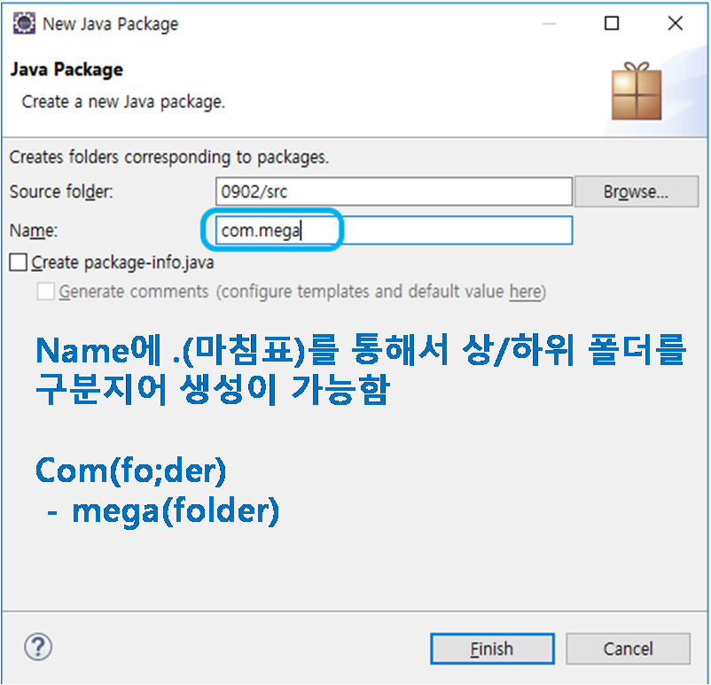
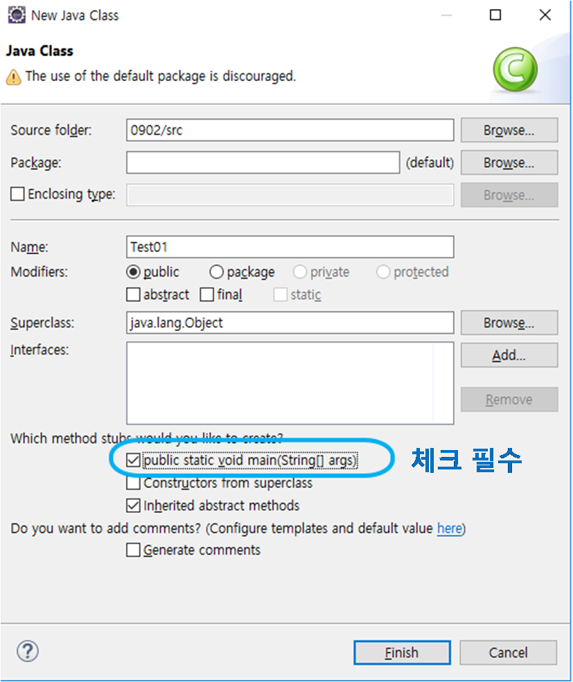
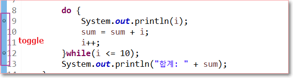

## 1. Java 프로그래밍 기초
### 1) 기본 개념
* java는 
	* 유니코드 체계이므로 2바이트를 1글자로 취급
	* 객체지향 언어

* 기본 자바 구조
	* 패키지 : 폴더
		
	* 임포트 : 다른 파일 연결
	* 클래스
		- 속성
		- 생성자
		- 메소드
		

* 실행구조
	* Java → 컴파일 → class(=byte code) → 로더 → exe 실행파일

* 연산자의 종류
	* 대입연산자 : =
	* 산술
	* 논리연산자 : &&(and), ||(or) → 결과가 true, false로 반환
	* 관계
	* 비트 : &(and), |(or) → 결과가 10진수로 반환됨
	* 증감 : ++변수, --변수, 변수++, 변수-- (2개까지 밖에 사용 못함)
	* 단축(축약) : +=, -= 
	* 이동 : 자리수를 변경해주는 것임(알 일이 있을까 싶긴함..) <<, >>, >>>
	* 조건 
	* 연결 :  +  (문자와 숫자, 숫자와 숫자, 문자와 문자)로 연결함.
		``System.out.println("사과는" + 100 + "원입니다.");``

* 연산자의 우선수위 : 증감 > 산술 > 대입

* String(클래스)로 변수를 생성하는 것은 힙(실제 메모리)에 저장됨.
* String을 통해 문자열을 사용하려면 아래와 같이
	```
	// String은 클래스로 변수를 생성하는 것으로 메모리의 스택이 아니라 힙(실제 영역)에 저장됨.
	// new 라는 코드가 힙에 저장시키게끔 하는 코드
		
		String s1 = "Hello world!!";  //new 가 생략된 형태
		String s2 = new String("I am a Programmer~");
		
		System.out.println(s1 + "\n" + s2);	
	 ```

* 	Scanner 패키지를 import를 해서 input 하는 방법
	```
	// ctrl + shift + O 를 통해 필요한 패키지 자동으로 적용 가능
	// (import가 안 되어있는데 해당 패키지 코드로 작성되었을 때 가능함)
		
		Scanner input = new Scanner(System.in);
		
		System.out.println("가로를 입력하세요>> ");
		w = input.nextInt();
		
		System.out.println("세로를 입력하세요>> ");
		h = input.nextInt();
		
		sum = w * h;
		System.out.println("넓이는 " + sum);
	```

#### 디버깅(debuging)
* toggle을 통해 디버깅할 대상을 지정하여 각 코드가 돌아가는 걸 눈으로 확인하면서 디버깅이 가능
* debug as 를 통해 디버깅 창으로 이동 (alt + shift + d,x )
	

#### 시스템 시간 표현하기(Data 클래스)
* 최근엔 timezone을 더 사용한다고 함.
		```
		Date date = new Date();
		int currentHour = date.getHours();
		int currentMin = date.getMinutes();
		System.out.println(currentHour+":"+currentMin);
		```


### 2) 조건문
#### 제어문
	* 조건문 : if, switch-case
	* 반복문 : for, while, do~while
	* 분기문 : break, continue, 라벨문

#### if 조건문 중첩사용
* 중괄호의 경우, True일 때 실행되는 코드가 2줄 이상일 때 사용함. 
* 1줄일 경우, 굳이 중괄호가 없어도 됨
	```
	if(조건식) {
	
	}else if(조건식) {
	
	}else if(조건식) {
	
	}else {
	}
	```
#### switch - case 문에 가능한 변수
* 정수(byte, short, int)
* 문자,  문자열 (ver8 이상부터 가능)
* 실수열 & long(정수) type은 불가능
	```
	int score, result ;
				
	System.out.println("점수 입력");
	score = input.nextInt();
	
	//switch( ) : 괄호 안에는 수식이 들어도 됨. 어차피 결과가 정수이니까
	switch(score / 10) {
	case 10 :       // case 10은 어차피 '수'로 나오는 거니까 case9 와 동일하므로 코드 불필요.
	case 9 : System.out.println("수"); break;
	case 8 : System.out.println("우"); break;
	case 7 : System.out.println("미"); break;
	case 6 : System.out.println("양"); break;
	default : System.out.println("가");
		}
	```

### 3) 반복문
#### while 반복문
1. while (조건문)
	* 조건문이 참이면 코드 실행, 거짓이면 스탑   
 
2. do, while (실행 후, 조건문)
	* do 밑에 코드가 실행되고 while 조건문 체크, 다시 do 실행되고 while 조건문 체크 하는 방식임.
	* do 밑 코드를 바로 실행되기 때문에 조건에 상관없이 무조건 첫번째 코드는 실행됨.
	
#### For 반복문
* For ( 변수 선언;  조건문;  증감문) {   }
* For (   ) 괄호 안에 변수 선언, 조건문, 증감문이 포함.
* 세미콜론은 변수 선언과 조건문에만 붙음
	``` 
	for (int A=1; A<10; A+=1) { 문장1; 문장2;    }
	```
* 향상된 For 문 (=for - each 문)
	``` 
	for (변수타입 변수 : 배열명 ) { 문장1; 문장2; }
	for (int i : list) { System.out.print(list[i]); }
	```

#### printf("    ", 변수1,변수2,변수3) 
* 파이썬에서 format이랑 같은데, 변수 타입마다 코드를 바꿔줘야함
* %d 정수 | %f  실수 | %c 문자 | %s 문자열
* 각 %와 알파벳 사이에 숫자를 넣어서 자리의 공간을 확보하는 것이 가능함
	```
	System.out.printf("%d * %d = %2d\n", i,j,(i*j));
	>> 2 * 1 =  2  (결과에 %2d를 했기에 1자리여도 2자리수 위치에 자리잡음)
	>> 2 * 9 = 18
	```
#### Break | continue
* Break : 특정 조건에 부합하면 정지, 그 이전까지만 실행되는 원리
* continue : 특정 조건에 부합하면 그 조건만 skip하고 넘어가는 원리

### 4) 배열
#### 기본
* 배열은 같은 자료형끼리 모아두는 하나의 집합임
* 코드 : 데이터형[ ] 배열명 = new 데이터형[크기]
* 여기서 주목할 것은 파이썬과 다르게 배열의 [크기]를 지정해야한다는 것이다. 유동성이 없는 편.
`` int[] list = new int[10]``
* 배열 내 원소 삽입, 이렇게 원소를 바로 대입할 경우엔 new가 없어도 됨(자동으로 인식함)
``int [ ] list = {1, 2, 3, 4, 5} ``
* 귀찮다면 for 문 이용해서 넣으세용. 파이썬과 numpy가 그립군용...


#### 배열 복사
* System.arraycopy : 한 배열을 다른 배열에 원소를 복사하는 것
	```
	arraycopy(소스배열, 시작위치, 복사배열, 복사위치, 개수) ;
	System.arraycopy(src, srcPos, dest, destPos, length);
	```

#### 배열 정렬
* Array.sort(배열명);
	* 오름차순으로 정렬해줌
	* 정렬된 배열은 그대로 배열에 반영됨

#### 2차원 배열
* java 특징으로는 배열의 크기에서 열의 length는 가변적이라는 것임. 서로 달라도 됨
* 데이터형[][] 배열명 = new 데이텨형[크기][크기]
	```
	# 딱 맞아떨어지는 배열
	int[][] array = {
					{10, 20, 30, 40},
					{50, 60, 70, 76},
					{88, 99, 110, 120}
			};
	# 열의 length가 서로 다른 배열
	int[][] array = {
					{10, 20, 30, 40},
					{50, 76},
					{88, 110, 120}
			};
	```
#### Math.random() : 0< x < 1 사이의 난수 발생


### 5) 클래스 ,객체 등의 개념

#### 객체
* 객체는 상태와 동작을 가지고 있음
	* 상태 : 객체의 특징값(속성(이다
	* 동작 : 객체가 취할 수 있는 동작
	* 자동차(객체)의
	* 상태 : 모양, 색, 크기, door 수, 타이어, 브랜드 등
	* 동작 : 운전하다, 주차하다, 코너링하다, 후진하다 등

#### 객체 지향
* 실제 세계를 모델링하여 소프트웨어를 개발하는 것
* 3대 특징
	* 캡슐화 
		* 관련된 데이터와 알고리즘(코드)이 하나의 묶음으로 정리되어 있는 것
		* 정보 은닉 : 객체를 캡슐로 싸서 객체의 내부를 보호하는 하는 것이다. 즉 객체의 실제 구현 내용을 외부에 감추는 것이다.  

	* 상속
		* 이미 작성된 클래스(부모 클래스)를 이어받아서 새로운 클래스(자식 클래스)를 생성하는 기법
		* 기존의 코드를 재활용하기 위한 기법

	* 다형성
		* 하나의 이름(방법)으로 많은 상황에 대처하는 기법
		* 개념적으로 동일한 작업을 하는 멤버 함수들에 똑같은 이름을 부여할 수 있으므로 코드가 더 간단해진다

	#### 클래스
* 클래스(class): 객체를 만드는 설계도
* 클래스로부터 만들어지는 각각의 객체를 특별히 그 클래스의 인스턴스(instance)라고도 한다.	

#### 오버라이딩
* 부모클래스의 메소드를 자식 클래스에서 사용하는 경우를 일컫음

#### 오버로딩
* 특징
	1. 메소드의 이름은 같아야 한다
	2. 매개변수의 개수가 달라야 한다
	3. 매개변수의 개수가 같다면 dtype이 달라야 함
	4. 반환값은 상관없다.
		```
		int add (int x, int y)
		int add (double x, int y)
		double add (int x, int y, int z)
		```
					
