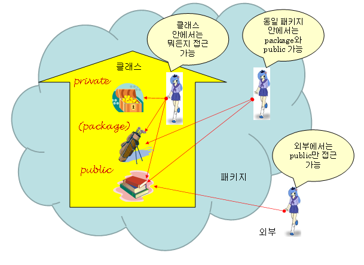
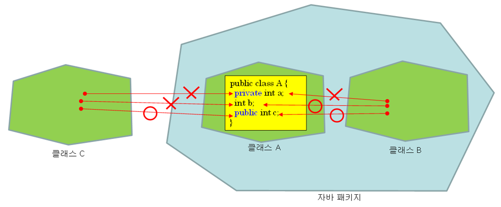
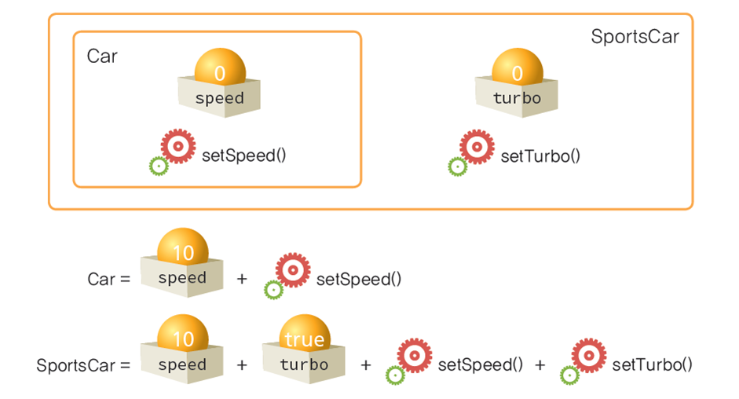
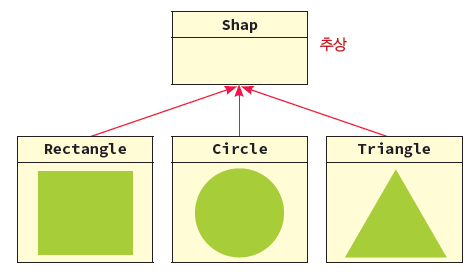
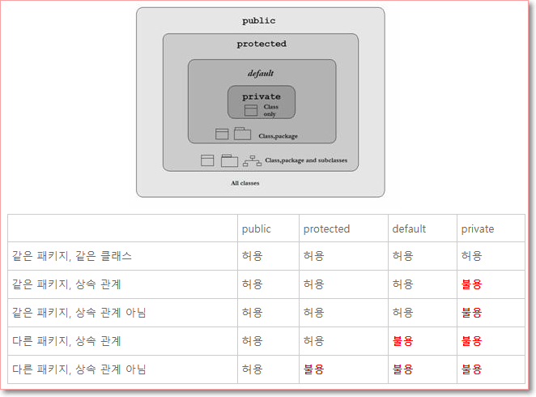
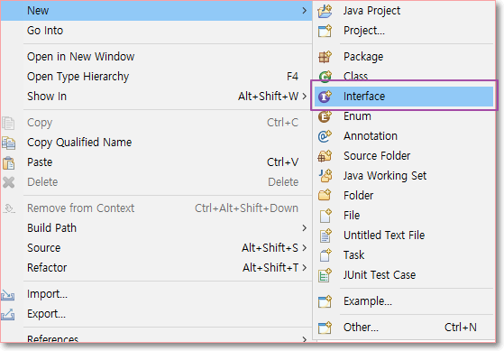
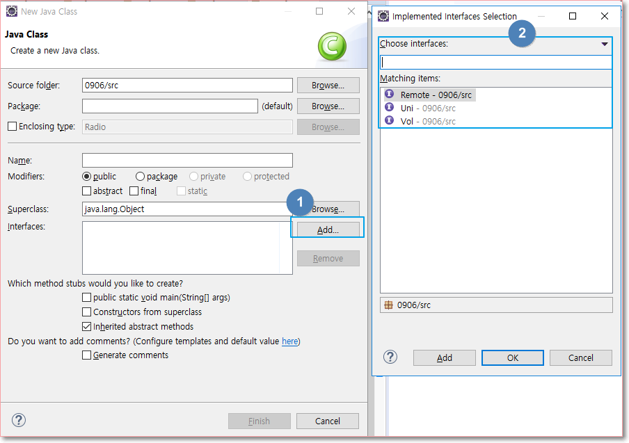

## 1. Java 프로그래밍 기초
### 1) 기본 개념
* java는 
	* 유니코드 체계이므로 2바이트를 1글자로 취급
	* 객체지향 언어

* 기본 자바 구조
	* 패키지 : 폴더
		
	* 임포트 : 다른 파일 연결
	* 클래스
		- 속성
		- 생성자
		- 메소드
		

* 실행구조
	* Java → 컴파일 → class(=byte code) → 로더 → exe 실행파일

* 연산자의 종류
	* 대입연산자 : =
	* 산술
	* 논리연산자 : &&(and), ||(or) → 결과가 true, false로 반환
	* 관계
	* 비트 : &(and), |(or) → 결과가 10진수로 반환됨
	* 증감 : ++변수, --변수, 변수++, 변수-- (2개까지 밖에 사용 못함)
	* 단축(축약) : +=, -= 
	* 이동 : 자리수를 변경해주는 것임(알 일이 있을까 싶긴함..) <<, >>, >>>
	* 조건 
	* 연결 :  +  (문자와 숫자, 숫자와 숫자, 문자와 문자)로 연결함.
		``System.out.println("사과는" + 100 + "원입니다.");``

* 연산자의 우선수위 : 증감 > 산술 > 대입

* String(클래스)로 변수를 생성하는 것은 힙(실제 메모리)에 저장됨.
* String을 통해 문자열을 사용하려면 아래와 같이
	```
	// String은 클래스로 변수를 생성하는 것으로 메모리의 스택이 아니라 힙(실제 영역)에 저장됨.
	// new 라는 코드가 힙에 저장시키게끔 하는 코드
		
		String s1 = "Hello world!!";  //new 가 생략된 형태
		String s2 = new String("I am a Programmer~");
		
		System.out.println(s1 + "\n" + s2);	
	 ```

* 	Scanner 패키지를 import를 해서 input 하는 방법
	```
	// ctrl + shift + O 를 통해 필요한 패키지 자동으로 적용 가능
	// (import가 안 되어있는데 해당 패키지 코드로 작성되었을 때 가능함)
		
		Scanner input = new Scanner(System.in);
		
		System.out.println("가로를 입력하세요>> ");
		w = input.nextInt();
		
		System.out.println("세로를 입력하세요>> ");
		h = input.nextInt();
		
		sum = w * h;
		System.out.println("넓이는 " + sum);
	```

#### 디버깅(debuging)
* toggle을 통해 디버깅할 대상을 지정하여 각 코드가 돌아가는 걸 눈으로 확인하면서 디버깅이 가능
* debug as 를 통해 디버깅 창으로 이동 (alt + shift + d,x )
	

#### 시스템 시간 표현하기(Data 클래스)
* 최근엔 timezone을 더 사용한다고 함.
		```
		Date date = new Date();
		int currentHour = date.getHours();
		int currentMin = date.getMinutes();
		System.out.println(currentHour+":"+currentMin);
		```


### 2) 조건문
#### 제어문
	* 조건문 : if, switch-case
	* 반복문 : for, while, do~while
	* 분기문 : break, continue, 라벨문

#### if 조건문 중첩사용
* 중괄호의 경우, True일 때 실행되는 코드가 2줄 이상일 때 사용함. 
* 1줄일 경우, 굳이 중괄호가 없어도 됨
	```
	if(조건식) {
	
	}else if(조건식) {
	
	}else if(조건식) {
	
	}else {
	}
	```
#### switch - case 문에 가능한 변수
* 정수(byte, short, int)
* 문자,  문자열 (ver8 이상부터 가능)
* 실수열 & long(정수) type은 불가능
	```
	int score, result ;
				
	System.out.println("점수 입력");
	score = input.nextInt();
	
	//switch( ) : 괄호 안에는 수식이 들어도 됨. 어차피 결과가 정수이니까
	switch(score / 10) {
	case 10 :       // case 10은 어차피 '수'로 나오는 거니까 case9 와 동일하므로 코드 불필요.
	case 9 : System.out.println("수"); break;
	case 8 : System.out.println("우"); break;
	case 7 : System.out.println("미"); break;
	case 6 : System.out.println("양"); break;
	default : System.out.println("가");
		}
	```

### 3) 반복문
#### while 반복문
1. while (조건문)
	* 조건문이 참이면 코드 실행, 거짓이면 스탑   
 
2. do, while (실행 후, 조건문)
	* do 밑에 코드가 실행되고 while 조건문 체크, 다시 do 실행되고 while 조건문 체크 하는 방식임.
	* do 밑 코드를 바로 실행되기 때문에 조건에 상관없이 무조건 첫번째 코드는 실행됨.
	
#### For 반복문
* For ( 변수 선언;  조건문;  증감문) {   }
* For (   ) 괄호 안에 변수 선언, 조건문, 증감문이 포함.
* 세미콜론은 변수 선언과 조건문에만 붙음
	``` 
	for (int A=1; A<10; A+=1) { 문장1; 문장2;    }
	```
* 향상된 For 문 (=for - each 문)
	``` 
	for (변수타입 변수 : 배열명 ) { 문장1; 문장2; }
	for (int i : list) { System.out.print(list[i]); }
	```

#### printf("    ", 변수1,변수2,변수3) 
* 파이썬에서 format이랑 같은데, 변수 타입마다 코드를 바꿔줘야함
* %d 정수 | %f  실수 | %c 문자 | %s 문자열
* 각 %와 알파벳 사이에 숫자를 넣어서 자리의 공간을 확보하는 것이 가능함
	```
	System.out.printf("%d * %d = %2d\n", i,j,(i*j));
	>> 2 * 1 =  2  (결과에 %2d를 했기에 1자리여도 2자리수 위치에 자리잡음)
	>> 2 * 9 = 18
	```
#### Break | continue
* Break : 특정 조건에 부합하면 정지, 그 이전까지만 실행되는 원리
* continue : 특정 조건에 부합하면 그 조건만 skip하고 넘어가는 원리

### 4) 배열
#### 기본
* 배열은 같은 자료형끼리 모아두는 하나의 집합임
* 코드 : 데이터형[ ] 배열명 = new 데이터형[크기]
* 여기서 주목할 것은 파이썬과 다르게 배열의 [크기]를 지정해야한다는 것이다. 유동성이 없는 편.
`` int[] list = new int[10]``
* 배열 내 원소 삽입, 이렇게 원소를 바로 대입할 경우엔 new가 없어도 됨(자동으로 인식함)
``int [ ] list = {1, 2, 3, 4, 5} ``
* 귀찮다면 for 문 이용해서 넣으세용. 파이썬과 numpy가 그립군용...


#### 배열 복사
* System.arraycopy : 한 배열을 다른 배열에 원소를 복사하는 것
	```
	arraycopy(소스배열, 시작위치, 복사배열, 복사위치, 개수) ;
	System.arraycopy(src, srcPos, dest, destPos, length);
	```

#### 배열 정렬
* Arrays.sort(배열명);
	* 오름차순으로 정렬해줌
	* 정렬된 배열은 그대로 배열 자체에 저장됨(오름차순으로 저장된다는 의미)

#### 2차원 배열
* java 특징으로는 배열의 크기에서 열의 length는 가변적이라는 것임. 서로 달라도 됨
* 데이터형[][] 배열명 = new 데이텨형[크기][크기]

	```
	# 딱 맞아떨어지는 배열
	int[][] array = {
					{10, 20, 30, 40},
					{50, 60, 70, 76},
					{88, 99, 110, 120}
			};
	# 열의 length가 서로 다른 배열
	int[][] array = {
					{10, 20, 30, 40},
					{50, 76},
					{88, 110, 120}
			};
	```
#### Math.random() : 0< x < 1 사이의 난수 발생
* Random : 번외로 정수형태의 난수 를 생성하는 클래스
* Random.nextInt(int) : 괄호 안의 숫자 -1 까지의 정수를 랜덤으로 생성함

```
import java.util.Random;
int random_int;
Random ran = new Random();
random_int = ran.nextInt(3);
```


### 5) 클래스 ,객체 등의 개념

#### 객체
* 객체는 상태와 동작을 가지고 있음
	* 상태 : 객체의 특징값(속성(이다
	* 동작 : 객체가 취할 수 있는 동작
	* 자동차(객체)의
	* 상태 : 모양, 색, 크기, door 수, 타이어, 브랜드 등
	* 동작 : 운전하다, 주차하다, 코너링하다, 후진하다 등

#### 객체 지향
* 실제 세계를 모델링하여 소프트웨어를 개발하는 것

#### 클래스
* 클래스(class): 객체를 만드는 설계도
* 클래스로부터 만들어지는 각각의 객체를 특별히 그 클래스의 인스턴스(instance)라고도 한다. 
* 클래스 특징 3가지
	* 접근 제어(캡슐화)
		* 관련된 데이터와 알고리즘(코드)이 하나의 묶음으로 정리되어 있는 것
		* 정보 은닉 : 객체를 캡슐로 싸서 객체의 내부를 보호하는 하는 것이다. 즉 객체의 실제 구현 내용을 외부에 감추는 것이다.  

	* 상속(오버라이딩)
		* 이미 작성된 클래스(부모 클래스)를 이어받아서 새로운 클래스(자식 클래스)를 생성하는 기법
		* 기존의 코드를 재활용하기 위한 기법

	* 다형성(오버로딩)
		* 하나의 이름(방법)으로 많은 상황에 대처하는 기법
		* 개념적으로 동일한 작업을 하는 멤버 함수들에 똑같은 이름을 부여할 수 있으므로 코드가 더 간단해진다

#### 접근 제어
* 접근 제어(access control): 다른 클래스가 특정한 필드나 메소드에 접근하는 것을 제어하는 것
	
	

* 정보은닉(=캡슐화)은 다음과 같은 이유에서 필요함
	* 클래스의 속성 보존(잘못된 수정으로 error가 발생되는 걸 방지 가능)
	* 정보 유출 방지

* 정보은닉을 위해서 속성은 보존하고 이를 임시로 활용할 수 있게 하는 것이 get / set 2가지
	* set은 속성의 값 또는 상태를 변화시킬 수 있음
	* get은 해당 속성을 불러올 수 있음
	* 각 속성당 get/set 2개 모두가 필요한데 모든 속성별로 만드려면 힘드므로,   
	eclipse 안의 메뉴 - [Source] - [generate Getter and Setter]을 통해 손쉽게 생성 가능

#### 다형성 = 오버로딩
* 특징
	1. 메소드의 이름은 같아야 한다
	2. 매개변수의 개수가 달라야 한다
	3. 매개변수의 개수가 같다면 dtype이 달라야 함
	4. 반환값은 상관없다.
		```
		# 아래는 변수명이 모두 같지만 datatype이나 파라미터가 모두 다르므로 사용 가능함
		int add (int x, int y)
		int add (double x, int y)
		double add (int x, int y, int z)
		```
					
#### 생성자
* 정의 : 객체가 생성될 때에 필드에게 초기값을 제공하고 필요한 초기화 절차를 실행하는 메소드
* 클래스 이름과 동일한 메소드가 생성자이며, 이를 사용하면 초기화가 실행됨.
* 생성자도 오버로딩(다형성)으로 여러가지 만들 수 있음.
```
	public class TimeMain {
	private int hour, min, sec;
	
	# 아래 2개는 생성자지만 각각 기본 생성자/파라미터 생성자로 구분된다. 
	# 기본 생성자 : 원래는 int의 초기값은 0 이지만, 생성자를 통해서 초기값을 딱 정해버리는 코드	
		public TimeMain() {
			hour = 9;
			min = 15;
			sec = 33;
		}
	# 파라미터 생성자 : 생성자에 파라미터를 부여해서 초기값을 원하는대로 지정해주는 코드
		public TimeMain(int h, int m, int s) {
			hour = h;
			min = m;
			sec = s;
		}
```

#### 상속 = 오버라이딩
* 부모클래스의 메소드를 자식 클래스에서 사용하는 경우를 일컫음   
* 부모클래스 = Parent class = Super class  | 자식클래스 = child class = sub class
	

* 특징
	1. 부모/자식 클래스에서 사용된다.
		- 자식은 1개의 부모클래스만 상속 받을 수 있음!! (이를 나중에 해결할 수 있는 게 '인터페이스'라고 함)
	2. 사용 시, 메소드 이름이 동일해야 한다.
	3. 매개변수의 개수와 데이터형이 같아야 한다.
	4. 반환 dtype 도 동일해야 한다. (**오버로딩은 반환 dtype이 달라야 하는 거랑 헷갈리지 말기**)
		- 오버로딩은 동일한 클래스 내에서만 적용되는 것!!! 
		- 오버라이딩은 부모/자식 클래스 사이에서 적용되는 것!!
		```
		class 부모 
			int add (int x)
		class 자식 extends 부모
			1) int add (int x) >> 이래야 오버라이딩!!
			2) int add (double x) >> 이건 자식 클래스 내에서의 오버로딩!!
		```
	
* 상속의 장점
	* 상속을 통하여 기존 클래스의 필드와 메소드를 재사용
	* 기존 클래스의 일부 변경도 가능
	* 상속을 이용하게 되면 복잡한 GUI 프로그램을 순식간에 작성
	* 상속은 이미 작성된 검증된 소프트웨어를 재사용
	* 신뢰성 있는 소프트웨어를 손쉽게 개발, 유지 보수
	* **코드의 중복을 줄일 수 있다**

* 만약, 부모클래스와 자식클래스의 동일한 메소드가 있을 경우, 생성된 객체는 자신의 클래스(부모/자식 중)에  있는 메소드를 사용함.

#### 상속과 생성자
* 생성자의 호출 순서는 (부모 클래스의 생성자) -> (자식 클래스의 생성자) 순으로 된다. 아래 코드를 참고.
* Parent_child_creator_call.java
	```
	class Parent{
		# 부모생성자
		public Parent() {
			System.out.println("부모생성자 호출");
		}
	}
	////////////////////////////
	class Child extends Parent{
		# 자식생성자
		public Child () {
			System.out.println("자식생성자 호출");
		}
	}
	public class MainTest {
		public static void main(String[] args) {
			# 부모클래스 객체 생성
			Parent p = new Parent();
			# 자식클래스 객체 생성
			Child c = new Child();
		}
	}
	>> 결과값
	>> 부모생성자 호출 ← 부모생성자에서 출력
	>> 부모생성자 호출 ← 자식생성자에서 출력
	>> 자식생성자 호출 ← 자식생성자에서 출력
	```
#### 추상 클래스
* 추상 클래스(abstract class): 몸체가 구현되지 않은 메소드를 가지고 있는 클래스. 메소드 원형만 있음.
* ShapeMain.java 참고
	```
	// abstract가 '추상'임을 나타내는 Keyword
	abstract class Shape {
		abstract void draw ();
	}
	```
	
* 추상 클래스는 추상적인 개념을 표현하는데 적당하다.
	 

* 추상 클래스의 특징
	* 추상 메소드는 반드시 하나 존재해야 한다
	* 일반 메소드를 만들 수 있다.
	* 일반 속성도 사용 가능하다.
	* 객체 생성은 불가능하다. 그 이유는 몸체가 없기 때문에 할당 받을 공간 자체가 없기 때문이다. 
	* 꼭 자식 클래스에게 상속시켜야 하고
	* 상속 받은 클래스는 추상 메소드를 정의(=구체화)해야한다. 

#### 종단 클래스
* 종단 클래스(final class)는 상속을 시킬 수 없는 클래스를 말한다.
	* final class 클래스명 { } : 종단 클래스
	* final void 메소드명 ( ) { } : 오버라이딩 안 됨(재사용 불가)
	* final int a = 100 ; : 상수 (값 변경 불가)
* 종단 클래스가 필요한 이유는 주로 보안상의 이유 때문이다.

#### 클래스 : public, package
#### 메소드 ,속성 : public, protected, private, package

### 6) 접근제어자 : Access Modifier
[출처 바로가기](https://m.blog.naver.com/PostView.nhn?blogId=2feelus&logNo=220576845725&proxyReferer=https%3A%2F%2Fwww.google.com%2F)
#### 1. Java의 접근자(modifier)들

Java 의 필드와 메소드들에 대한 접근 권한 제어를 modifier라고 한다.
  * 필드와 메소드에 적용 가능한 4개의 modifier가 존재
	 - private 
	 - default (= no modifier, 생략)
	 - public
	 - protected

* 클래스에는 2개만 사용 가능함.
	* public : 다른 패키지에서도 접근 가능
	* default : 같은 패키지에서만 사용 가능   

private은 같은 클래스 내에서만 접근 가능하고, default는 같은 폴더(패키지)내에서만 가능하고, protected는 같은 폴더(패키지)및 그 클래스를 상속(extends)해서 구현하는 경우 접근이 가능하며, public은 모든 클래스에서 접근이 가능하다.

**2. protected은 public과 별로 다른것 같지가 않은데**

private과 default, public의 경우는 그 용도가 명확한데, protected의 경우는 좀 애매하게 보일 수 있다. 
왜냐하면 사실상 그 기능은 public과 같은 역할을 하기 때문이다.  그러나 사실 protected는    
"상속받은(자식) 클래스에서 구현/수정해라" 와 같은 의미다. 

**3. protected의 역할**

protected 는 잠재적으로 자식 클래스가 Override해서 바꾸어야 할 경우를 고려한 modifier이다. 즉 완성되지 못한, 혹은 완성될 수 없는 클래스 멤버를 의미한다. 여기서 **"완성되지 못한/ 완성될 수 없는"의 의미가 중요**하다. 클래스를 디자인한 개발자가 이 메소드에 대해서 앞으로 더 구현할 것이 남았다거나, 혹은 디자인 컨셉트로서 일부러 완성시키지 않은 경우 둘 다를 의미할 수 있다.

public으로 된 메소드는 그대로 그냥 써도 충분한 이미 완성된 메소드를 의미한다.protected의 경우는 자식 클래스의 특성에 따라 적절히 변경해주어야 하는 상황을 고려한 메소드이다. 이런 경우가 언제 발생할까? 새(Bird)와 타조(Ostrich)라는 클래스를 생각해보자.

새는 일반적으로 날아서 이동한다. 즉 moveFast()라는 함수에서는 fly()라는 함수를 이용할수 있을 것이다. 이 객체를 사용해서 대부분의 새들을 정의할 수 있다.
```
public class Bird{
	void fly() {
	System.out.println("I am flying")
	}
	protected void moveFast() {
		fly();
		}
}
# 타조 클래스를 만들때도, 타조는 새의 일종이기에 새를 상속해서 만들 수 있다.
public class Ostrich extends Bird {
	public static void main(String[] args) {
		Ostrich ostrich = new Ostrich();
		ostrich.moveFast();
	}
	void run() {
	System.out.println("I am running")
	}
	protected void moveFast() {
		run();
	}
}
``` 

타조는 moveFast한다고 나는 게 아니라 달리는 것이므로 이 경우에는 moveFast() 함수 안에서 run()을 사용해야 한다. 숙련된 자바 프로그래머는 Bird클래스의 moveFast()메소드의 protected 키워드를 통해서, 이 함수가 바뀔 경우가 존재할수 있음을 짐작할 수 있다.

**4. Abstract와 protected의 용도상 차이점**

  그렇다면 abstract 메소드와는 무엇이 다를까? abstract 메소드는 abstract 로 선언된 클래스의 구현부를 일부러 비어놓아서, 그것을 상속하는 클래스는 반드시 해당 메소드를 구현해주어야 하는 방식이다. 부모클래스는 그자체로는 존재 할수 없고, 단지 추상적인 개념일 뿐이다. 실제 세상에 태어나는(instance)것은 자식 클래스에 의해서 이루어 지기 때문에, 자식 클래스는 반드시 abstract를 구현해야만 한다.

이에 반해 protected로 구현된 메소드는 반드시 자식클래스가 Override를 해야 할 필요가 없다. 대부분의 경우에는 상속하는 클래스가 직접 구현할 필요는 없지만, 그래도 특수한 상황에서는 protected로 선언된 메소드는 override해서 처리해야 할 수도 있음을 유저에게 알려주는 것이다.    
- **즉 protected는 굉장히 문서적으로, 클래스 상속을 하는 개발자에게 주의를 주는 방식인 셈이다.**    
(반면 abstraction은 강제적으로 override를 강제하는 구조라고 볼 수 있다)


### 7) 유효범위 : Scope
[생활코딩 Scope 가이드문서](https://www.opentutorials.org/course/1223/5447)
* 전역변수(Global variable) : 특정 메소드에 속한 변수가 아닌 가장 상위 클래스(파일명을 가진 클래스)에서 선언된 변수를 의미
* 지역변수(Local variable) : 특정 메소드 안에서 선언된 변수(main 안에서 선언한 변수 등)
	```
	class Scope {
		int = i;   << 전역변수
		
		public see() {
		int a = 0;  << a는 지역변수, see라는 메소드 안에서만 생성/호출 가능하고, 그 외에선 호출 불가능
		}
	}
	```
	

### 8) 인터페이스

#### 기본
* 추상 클래스 : 단일 상속만 가능
* 다중 상속을 하려면 '인터페이스'를 사용해아함
* 이클립스에서의 생성 방법
	
* 클래스 생성 시, 인터페이스 바로 implements하기
	
	
* 인터페이스의 특징
	1. 상수와 추상메소드만 인터페이스 내에 사용(존재)할 수 있음
	2. interface 라는 키워드를 사용
	3. 객체 생성이 불가능
	4. 인터페이스끼리 상속 가능

```
 # 인터페이스 코드 예시 
//인터페이스 선언 (추상 메소드와 상수 밖에 가지지 못하는 녀석)
public interface Remote {
	// 추상메소드 (abstract가 없어도 알아서 추상으로 판단함)
	public void turnOn();
	public void turnOff();
}

//////////////////////////////////////////
#인터페이스 다중 상속 : 쉼표로 사용
public class B implements 인터1, 인터2 { }

#인터페이스끼리의 상속 : extend를 사용함
public interface 인터1 extends 인터2, 인터3 { }

#클래스에 클래스&인터페이스 상속 (extends와 implements 모두 사용)
public class A extends B implemnets 인터1, 인터2 { }
```	
