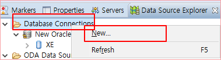

#### 2019년 9월 16일 월요일, 이경희 강사님
* 공대가 좋아하는 강의st
* 서울시 빅데이터 경진대회 관련해서 참고해보기
* 4차 산업의 Keyword는 융합(컨버젼스) 
* 이상치라고 반드시 버릴 이유가 없다. 왜 이상치인지, 왜 발생했는 지에 대해 고민해보는 것도 방법
* MVC (Model View Controller) 
	* 컨트롤러는 프론트 컨트롤러, 액션 컨트롤러, 서비스 컨트롤러로 구성됨
	* 프론트가 말많은 주방 쉪
	* 액션이 실제 요리하는 메인 쉪
	* 서비스가 재료 준비하는 보조로 비유할 수 있음
	* 이걸 만들어볼 예정
	

### Eclipse EE OXYZEN 설치
* [설치페이지](https://www.eclipse.org/downloads/download.php?file=/technology/epp/downloads/release/oxygen/3a/eclipse-jee-oxygen-3a-win32-x86_64.zip)
* 해당 버전은 DB 및 WEB 연동이 가능한 Java 프로그램임
* 설치가 아닌 zip파일을 선호하는 이유는 install의 경우엔 나중에 설치오류/충돌 등이 생길 수 있으나   
zip은 그냥 압축만 풀어서 사용이 가능함.
* 이렇게 서로 다른 버전들을 모두 사용이 가능하다는 장점이 있음
### 아래 그림은 설치 후, 해줘야할 encoding 변경 작업

### 아래 그림은 Oracle 설치 후, 이클립스에서 오라클 연동하는 방법

### 배열의 재구성
1. 기존 배열에 +1 공간을 확보하여 임시배열에 넣는다. 
	- A[2]  : 0, 1, 2 인덱스 공간 소유한 상태
	- imsi[2+1] : A배열보다 1크게 만듦
	- 
* ArrayCopy(카피할 배열, 카피할 배열 시작위치, 넣을 배열, 넣을 배열 위치, 복사할 길이)
* A = imsi 

### Collection
#### 구성
1. Collection
	1. List
		1. LinkedList
		2. ArrayList
	2. Set
		1. HashSet
	3. Map : Key : value (python의 dict와 유사한 개념)

#### <제네릭>
* ArrayList 엔 다양한 dtype을 담을 수 있음
* 그래서 <제네릭>을 부여하여 특정 dtype만 담을 수 있도록 일반화 하는 것
 * 제네릭에는 클래스, dtype 등을 다양하게 지정 가능
 `ArrayList<클래스, dtype> 리스트명`

### 오버라이딩, 오버로딩
* 오버로딩(다형성) : 부모에다가 자식 클래스를 넣는 것
* 오러라이딩 : 부모 클래스를 자식 클래서에서 재정의 하는 것
	* 오버라이딩의 제약조건
		* 접근지정자(=접근제한자)는 부모와 같거나 커야 오버라이딩이 가능함 (private < protected < public )
		` ex) 부모가 protected 메서드를 사용하면 자식은 protected 또는 public 메서드로만 사용 가능`
		* 예외처리문구 : 자식이 예외문구를 가지고 있다면 부모도 예외문구를 가지고 있어야 한다. 
		* throws Exception
		` ex) protected AA ( ) throws Exception { }`

