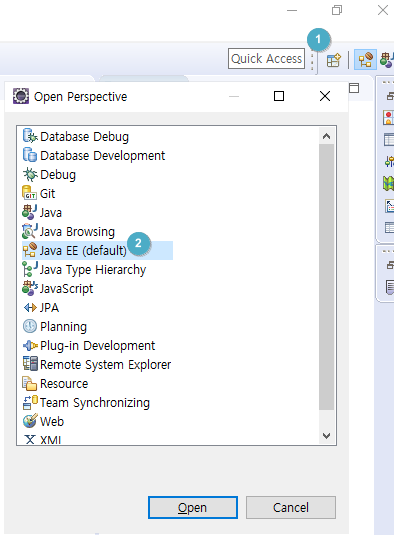
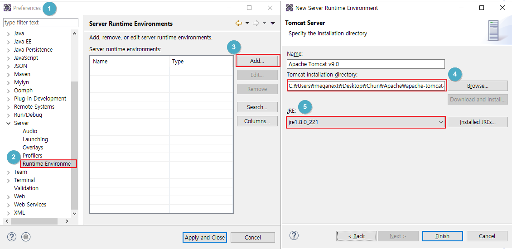
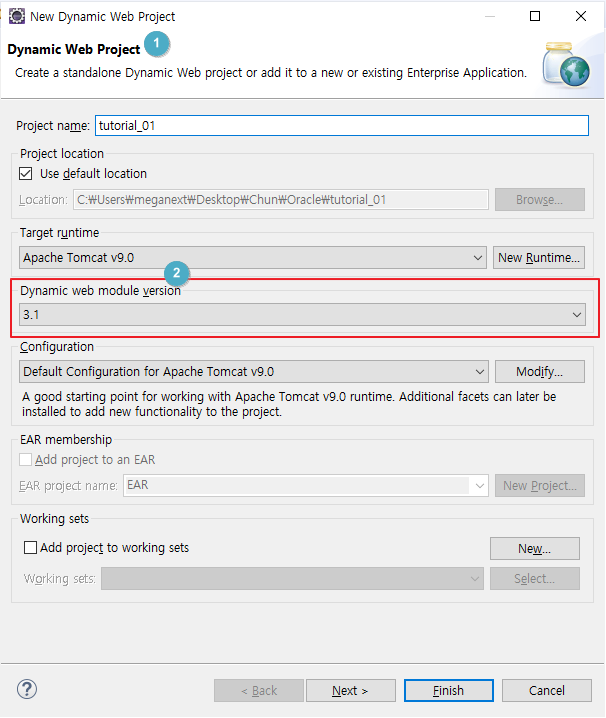
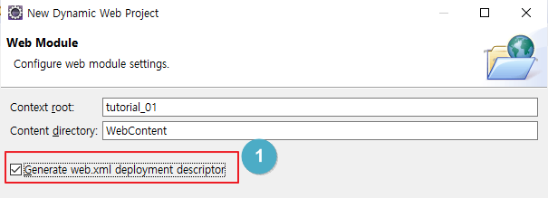
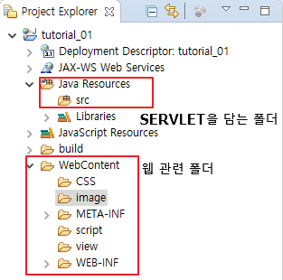

## JSP WEB programing

 
|Client|<--Internet-->|Server|
|--|--|--|
|HTML|HTML은 정적webpage 구현 가능, PHP/JSP는 동적webpage 구현 가능|미들웨어(JSP & SERVLET)|			
|CSS|<-틀, 구현|데이터베이스(Oracle 11g)|
|JavaScrpit|<-Event|웹서버(WAS : Apache Tomcat)|
|웹브라우저||

### Tomcat 다운로드 및 이클립스/시스템 설정 
* JSP 교재의 p30 참고 : [3.2 JAVA_HOME 환경 변수 설정] 참고해서 시작











#### apache tomcat 서버 사용 시, 아래와 같은 폴더 구조로 구성되어 있어야 한다. 
* 이런게 잘 구성되어 있지 않다면, "404 NOT FOUND" 경고가 뜨게 된다. 
* 그래서 폴더와 파일의 구성과 위치가 중요함

1. SRC
2. WEB content
	- HTML
	- CSS
	- JavaScript
	- JSP
	- Image 등

* 전달 및 불러오기 방식
	* Get / Post
		* Get  : 조금 작은 용량, 쿼드스트링 전달
		* Post : Get보다 큰 용량, 보안이 필요할 때(로그인 정보 등
	* Get / Post는 요청(Requset)한대로 Response 해야함 
<hr>
### HTML(Hyper Text Markup Language) => HTTP protocol
#### 1) 목적 : Display = 웹브라우저를 통해서 작성한 글(내용)이 웹 브라우저 상에 어떻게 보여질 지를 지정하는 것
- web page를 작성하기 위한 mark up 언어
- 문서의 구조, 틀, 뼈대를 만드는 언어 => 이걸 꾸며주는 것이 CSS(Style)

#### 2) 구조 = 구문
- 형식
	- tag안에 tag를 넣을 수 있는 경우 : <start태그명> 내용 </end태그명>
	- tag안에 tag를 못 넣는 경우 : <start태그명/>    (바로 열고 닫아버리는 것)
	- 옵션 부여 : <start태그명 옵션내용> 내용 </end태그명>
- 기본 구문 :  *.html , *.htm(확장자 글자수가 4개 넘어가면 못읽는 경우도 있어서 이렇게 줄일 수 있음)   
	- <html>  : root 태그, html 시작, 대소문자 상관없음.
	```
	<html> 
		<head>
			- <title> : 페이지 제목
			- <meta> : 페이지의 정보
				<body>
					- 페이지를 통해서 보여줄 내용을 담는다.
					- 영역을 분할해서 작성하며, 이를 시멘틱 tag라고 한다.
						<header> <nav> <footer>
						<contents> <section> <article> <aside>
				</body>
		</head> 
	```
* 기본 tag
	<p> p :  paragraph, 단락태그
	<br> br : Enter, 줄바꿈 태그<br>
	<b> b : bolder, 글자 진하게<br></b>
	<i> i : italic, 기울임<br></i>
	<u> u :underline, 밑줄, HTML5에선 사용 안 한다네??<br></u>
	<font> font : 글꼴과 관련된 태그<br>
		- 속성(attribute) : size(1~6, default 3), color, face<br>
* ul , ol : 목록을 표현하는 태그, ol : 순서 | ul : 순서없는 태그<br>
* li : 목록에 포함되는 항목
* &nbsp : 스페이스바(공백문자, &nbsp(세미콜론이 붙어야함)) ``&nbsp;``


<h1>This is a Heading</h1>
<h2>H2 This is a Heading</h2>
<h3>H3 This is a Heading</h3>
<h4>H4 This is a Heading</h4>
<h5>H5 This is a Heading</h5>
<h6>H6 This is a Heading</h6>
<p>This is a paragraph.<br>
동해물과 백두산이 마르고 닳도록 하느님이 보우하사 우리나라 만세 무궁화 삼천리 화려강산 대한사람 대한으로 길이 보전하세</p>

<p>
 이 기상과 이 맘으로 충성을 다하여 괴로우라 즐거우나 우리나라 만세
무궁하 삼천리 화려강산 늦은 밤 비가 내려와 널 데려가 
</p>

<hr> hr tag는 한줄 긋기<br>
유재석<br>
지석진<br>
김종국<br> **"기본적으로 br가 p 태그는 줄바꿈 기능은 동일하나 그 간격에서 p태그가 더 넓게 띄어짐.**
<hr>
<p>이광수</p>
<p>송지효</p>
<p>하하</p><hr>

#### 예시페이지 

<b><i><font size="5"> &nbsp;안녕하세요, 메가넥스트 카페입니다.</font></i></b><br>
<font size = "4" color = "blue"> 항상 좋은 재료로 맛있는 커피를 제공하겠슴다.</font>
<hr>
저희가 제공하는 메뉴<br>
<ul>
	<li>아이스 카페</li>
	<li>아이스 모카</li>
	<li>아메리카노</li>
	<li>아이스 카푸치노</li>
</ul>
<hr>
<a href="show.html">메뉴의 세부항목에 대한 설명</a>  
 * a href = "*.html"이라는 태그를 통해 하이퍼링크 설정 가능 
<hr>


### CSS : HTML에 style을 적용하기 위해 만들어진 언어
* 선택자 학습 사이트 [http://flukeout.github.io/](http://flukeout.github.io/)
1. 기본형식   

		선택자{
		적용할 style명 : 속성값;
		}
	-	태그 선택자 : 특정 태그에 스타일을 주고자 할 때 사용하는 선택자
	-	id : 하나의 요소 선택자
		#(샵)id명{
				
	-	class : 여러 개의 요소 선택자
		.(점)클래스명{
		}
	-	가상 선택자 

2. 적용하는 방법
	- 내부 스타일 : HTML 문서 안에 기술하는 형태 (내부스타일은 타 HTML page에 적용하지 못하는 단점)
	- 외부 스타일 : 별도의 CSS 파일을 생성하여 HTML 문서로 불러오는 경우 (다양한 page에 적용 가능)	


### JSP와 SERVLET
* 교재 p52

1. JSP : javaServer page의 약자
	- HTML 페이지 안에 JAVA 코드를 담아서 관리하는 페이지
	- JSP는 클래스를 만든 후에 실행을 하므로 속도가 다소 느림
	1) JSP 구성요소
		- 스크립트 구성요소
			- 표현식(Expression) :  웹에 변수나 값을 출력한다. 
			`<%= ~ %>`
			- 스크립트릿(Scriptlet) : 자바 코드를 실행하고 작성하는 영역 
			`<% ~ %>`
			- 선언부(Declaration) : 자바 메서드(함수)나 변수를 선언할 때 사용함. static 영역에 할당됨. 많이 사용되지는 않음.    
`<%! ~ %>`

		- 디렉티브(Directive) : 선언자, <%@ ~ %> , 주황색으로 표기됨.
			- JSP 페이지에 대한 정보를 지정/제공할 때 사용됨.
		- page : JSP 페이지에 대한 정보 제공, 생성하는 문서 타입,, 인코딩 등의 정보 포함 
		- include : JSP 페이지에서 사용할 태그 라이브러리를 지정한다.(=import)
		- taglib : JSP 페이지의 특정 영역에 다른 문서를 포함시킨다. 

2. SERVLET
	- Java파일 안에 HTML 태그를 담아서 관리하는 클래스
	- JSP와 달리 바로 클래스로서 실행이 가능하므로 JSP보다 실행속도가 빠름.
	- 서블릿(Servlet) : 서블릿클래스로부터 만들어진 객체, 단, 모든 객체가 서블릿이 되는 것은 아니다.   


	1) 서블릿 규약서 : 서블릿 클래스로부터 서블릿을 생성하는 규칙 
		- 임의의 클래스를 생성한 후, **HttpServlet 클래스를 상속받아 구현한다.**
		- doGet( )와 dePost( ) 메서드를 재정의(Override)한다.
		- 서버에 매핑(Mapping, 사상 또는 등록) 한다. 
